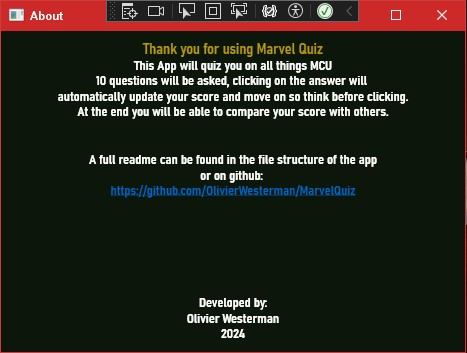

# MarvelQuiz
## Description
This app was made to find trivia questions about Marvel from this API: https://the-trivia-api.com/.
During play, you will be asked 10 questions which you can answer by simply clicking on the correct answer.
After 10 questions the game will display the score of the player in the Highscore Window.

To that end this App has some large seperate parts:
- Two class libraries (QuestionsLibrary and ScoreboardLibrary) containing the Question, Answer, PlayerScore and Scoreboard classes.
- A console application to demonstrate the basic usage of the QuestionsLibrary.
- A graphical WPF application to allow the user to do a Marvel quiz. 

## Author
This App was made by Olivier Westerman while studying at Vives Brugge in Spring 2024.

## Screenshots
### Console Demo App

### WPF Application

## Setup
To set up and use the App effectively, you'll need to make sure you have Microsoft Visual Studio installed as well as install or update the NuGet packages from Newtonsoft.Json (version 13.0.3 or higher).
It is also important to make sure you are working in a .NET 6 or higher environment.
You can find a step-by-step guide for installing these packages here:
- Visual Studio Community edition by following this [link](https://learn.microsoft.com/en-us/visualstudio/install/install-visual-studio?view=vs-2022).
- Newtonsoft.Json by following this [link](https://www.nuget.org/packages/Newtonsoft.Json/).
- .Net by following this [link](https://dotnet.microsoft.com/en-us/download/dotnet-framework).

Once everything is installed, open the project solution named 'MarvelQuiz.sln'. Then, build the solution to ensure all dependencies are resolved. 
At the top of your window, select which project you want to run with the dropdown and the click on the play button next to it to run.

## UML diagram
The following is the UML diagram for the Library as well as the other projects that it connects to.\
The UML of the Fraction class would only be the blue class.

This [link](https://lucid.app/lucidchart/fa9f4dd1-42d1-4eda-8caf-a2333c42a592/edit?viewport_loc=-6904%2C-2487%2C5453%2C2471%2CHWEp-vi-RSFO&invitationId=inv_ca96e9b4-c156-44bf-872b-b8a1ab53fb81) also leads to a diagram version that can be zoomed in on but you do need to sign in with a Lucid account for that.

## Future Improvements
- Left questions with pictures out of the design because that was not a requirement, could add it later.
- I'm also sure there is a more powerful way to code the WPF-application by breaking the code into smaller methods.
- In term of variety, I could have made a few extra options and allow the player to choose what topic they would like to be quizzed on by manipulating the API GET link in TriviaApiLibrary.

